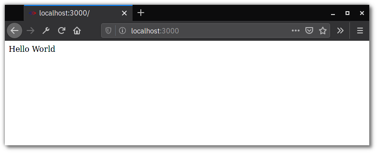
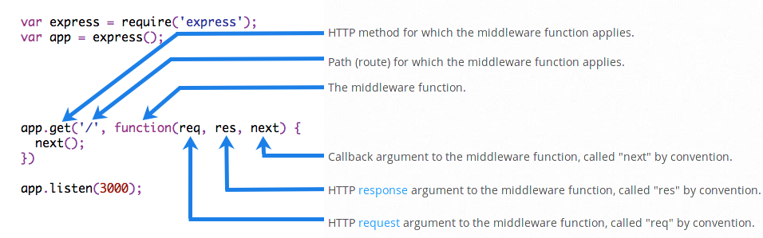
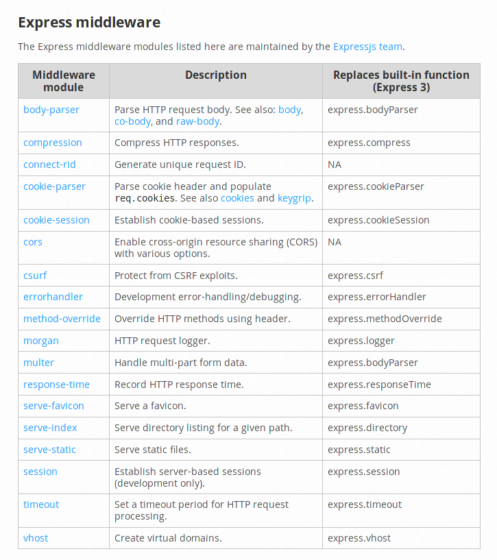

Setup Express 
=============
สร้างโปรเจค และทำการสร้าง ไฟล์ package.json

.. code-block:: bash
   :emphasize-lines: 11
   :linenos:

    mkdir projectname
    cd projectname
    npm init -y

    cat package.json

    {
        "name": "tutorial1",
        "version": "1.0.0",
        "description": "",
        "main": "index.js",
        "scripts": {
            "test": "echo \"Error: no test specified\" && exit 1"
        },
        "keywords": [],
        "author": "",
        "license": "ISC"
    }

.. hint::
    จะเห็นได้ว่า ได้มีกำหนด ไฟล์ index.js สำหรับเป็น ไฟล์ตั้งต้นของ Application หากต้องการเปลี่ยน
    เป็นชื่ออื่นก็สามารถทำได้ เช่น app.js หรือ server.js 

.. code-block:: bash
   :linenos:

    ติดตั้ง package express ด้วย  npm 

    npm install express --save
    npm install nodemon --save 

สร้าง ไฟล์ index.js และ route 

.. code-block:: javascript
   :caption: index.js
   :linenos:

    const express = require('express')
    const app = express()

    // add route
    app.get('/', (req, res) => {
      res.send('Hello World')
    })

    // start listen on port 3000
    app.listen(3000, () => {
      console.log('Start server at port 3000.')
    })

เริ่มต้นการทำงาน ด้วย

.. code-block:: bash
   :linenos:

    node index.js

เปิด browser ไปยัง  http://localhost:3000

Middleware 
**********

*middleware* คือฟังก์ชั่น ที่สามารถเข้าถึง request object (req)  และ response object(res)
และเชื่อมต่อกันไปยัง middleware ต่อไปด้วย  คำสั่ง next หน้าที่ดังต่อไปได้แก่

- ทำหน้าที่ execute บาง code 
- เปลี่ยนแปลง  request และ response object 
- สิ้นสุด request-response cycle 
- เรียก next middleware funtion 

แบ่งกลุ่มได้เป็น

- Application-level middleware
- Router-level middleware
- Error-handling middleware
- Buildin middleware
- Third-party middleware 

Application-level middleware
****************************

ทำการเชื่อม application-level middleware กับ instance *app object* ในรูปแบบ app.use(), app.METHOD()
function โดยที่ METHOD คือ HTTP method เพื่อรองรับการ request แต่ละประเภท ได้แก่ GET, PUT, POST  
หากใช้ use  จะทำให้ function ที่กำหนดให้เป็น args จะทำการ execute ทุกครั้ง ที่ app มีการรับ Request 

.. code-block:: javascript
   :linenos:

    var app = express()

    app.use(function (req, res, next) {
      console.log('Time:', Date.now())
      next()
    })

ตัวอย่างของ middleware ที่ทำการเชื่อม mounted กับ path */user/:id* โดย function จะทำงานทุกชนิด HTTP 

.. code-block:: javascript
   :linenos:

    app.use('/user/:id', function (req, res, next) {
      console.log('Request Type:', req.method)
      next()
    })

สามารถกำหนดให้เป็น multiple route ในแต่ละ path ต้วอย่าง เป็นการกำหนด 2 routes ให้แก่ */user/:id* 
และ สามารถเข้าถึงตัวแปร *id* จาก path ผ่านทาง req.params.id 

.. code-block:: javascript
   :linenos:

    app.get('/user/:id', function (req, res, next) {
    console.log('ID:', req.params.id)
    next()
    }, function (req, res, next) {
    res.send('User Info')
    })

    // handler for the /user/:id path, which prints the user ID
    app.get('/user/:id', function (req, res, next) {
    res.end(req.params.id)
    })

.. important::

   คำสั่ง next() จะสามารถใช้งานได้เพียงใน ฟังก์ชั่น  middleware เท่านั้น และจะทำการส่งต่อให้ 
   middleware fuction ต่อไปใน stack

เพิ่มเติม logic

.. code-block:: javascript
   :linenos:

    app.get('/user/:id', function (req, res, next) {
    // if the user ID is 0, skip to the next route
    if (req.params.id === '0') next('route')
    // otherwise pass the control to the next middleware function in this stack
    else next()
    }, function (req, res, next) {
    // send a regular response
    res.send('regular')
    })

    // handler for the /user/:id path, which sends a special response
    app.get('/user/:id', function (req, res, next) {
    res.send('special')
    })

.. hint::

   โดย function ที่สร้างให้เป็น middleware จะมี การรับค่า 3 args ได้แก่ req, res, next และ 
   เรียกใช้ next()

สามารถ นำ function middleware ทำให้ สามารถ reuse ได้ ง่ายต่อการใช้งาน โดยการใช้ ตัวแปร array

.. code-block:: javascript
   :linenos:
   

    function logOriginalUrl (req, res, next) {
       console.log('Request URL:', req.originalUrl)
    next()
    }

    function logMethod (req, res, next) {
       console.log('Request Type:', req.method)
    next()
    }

    var logStuff = [logOriginalUrl, logMethod]

    app.get('/user/:id', logStuff, function (req, res, next) {
    res.send('User Info')
    })

Router-level middleware 
***********************

Router-level middleware  ทำงานในลักษณะเดียวกัน เพียงแต่เป็นการเชื่อมเข้ากับ instance ของ  
express.Router() แทน จะเป็น instance app และทำการ  mount instance router  กับ 
instance app แทน

.. code-block:: javascript
   :linenos:

    var router = express.Router()
 
ตัวอย่างของ router 

.. code-block:: javascript
   :linenos:

    var app = express()
    var router = express.Router()

    // a middleware function with no mount path. This code is executed for every request to the router
    router.use(function (req, res, next) {
    console.log('Time:', Date.now())
    next()
    })

    // a middleware sub-stack shows request info for any type of HTTP request to the /user/:id path
    router.use('/user/:id', function (req, res, next) {
    console.log('Request URL:', req.originalUrl)
    next()
    }, function (req, res, next) {
    console.log('Request Type:', req.method)
    next()
    })

    // a middleware sub-stack that handles GET requests to the /user/:id path
    router.get('/user/:id', function (req, res, next) {
    // if the user ID is 0, skip to the next router
    if (req.params.id === '0') next('route')
    // otherwise pass control to the next middleware function in this stack
    else next()
    }, function (req, res, next) {
    // render a regular page
    res.render('regular')
    })

    // handler for the /user/:id path, which renders a special page
    router.get('/user/:id', function (req, res, next) {
    console.log(req.params.id)
    res.render('special')
    })

    // mount the router on the app
    app.use('/', router)

.. hint::
    หากต้องการข้าม router middleware ทั้งหมด ด้วยการเรียก next('router') เป็นการยุติ 
    การดำเนินการของ router instance

ตัวอย่าง การเชื่อม กับ / และ /admin path โดยมีการ สร้างเป็น Function 

.. code-block:: javascript
   :linenos:

    var app = express()
    var router = express.Router()

    // predicate the router with a check and bail out when needed
    router.use(function (req, res, next) {
    if (!req.headers['x-auth']) return next('router')
    next()
    })

    router.get('/', function (req, res) {
    res.send('hello, user!')
    })

    // use the router and 401 anything falling through
    app.use('/admin', router, function (req, res) {
    res.sendStatus(401)
    })

Error-handing middleware
************************

.. hint::
    Error-handing middleware จะมีการรับค่า 4 arguments เพื่อระบุว่าเป็น error-handleing 
    middleware function

.. code-block:: javascript
   :linenos:

    app.use(function (err, req, res, next) {
    console.error(err.stack)
    res.status(500).send('Something broke!')
    })

Built-in middleware 
*******************

เราใช้ build in middleware เพื่อเพิ่มความสามารถให้แก่ Express apps สามารถติดตั้งโดยการติดตั้ง 
node module 

.. code-block:: javascript
   :linenos:

    npm install cookie-parser

.. code-block:: javascript
   :linenos:

    var express = require('express')
    var app = express()
    var cookieParser = require('cookie-parser')

    // load the cookie-parsing middleware
    app.use(cookieParser())

`ตัวอย่าง ของ Express middleware <https://expressjs.com/en/resources/middleware.html>`_

